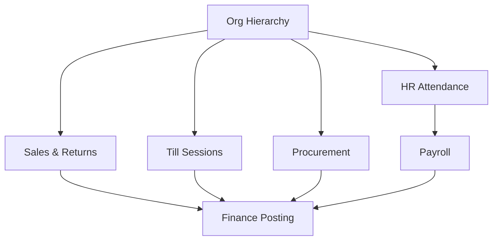

# Information Architecture

## Domain map

## IA sections
- Operations: POS, till, branch controls
- Inventory: items, suppliers, PO, GRN
- Finance: journals, recon, posting errors, controls
- People: employees, rosters, attendance, payroll
- Admin: policy config, audit logs, access

## Key entities
- Sales Receipt, Return, Refund, Till Session, Cash Drop
- Purchase Order, Goods Receipt, Inventory Movement
- Journal Entry/Lines, Reconciliation Snapshot, Posting Error
- Employee, Roster, Attendance Daily, Payroll Run
