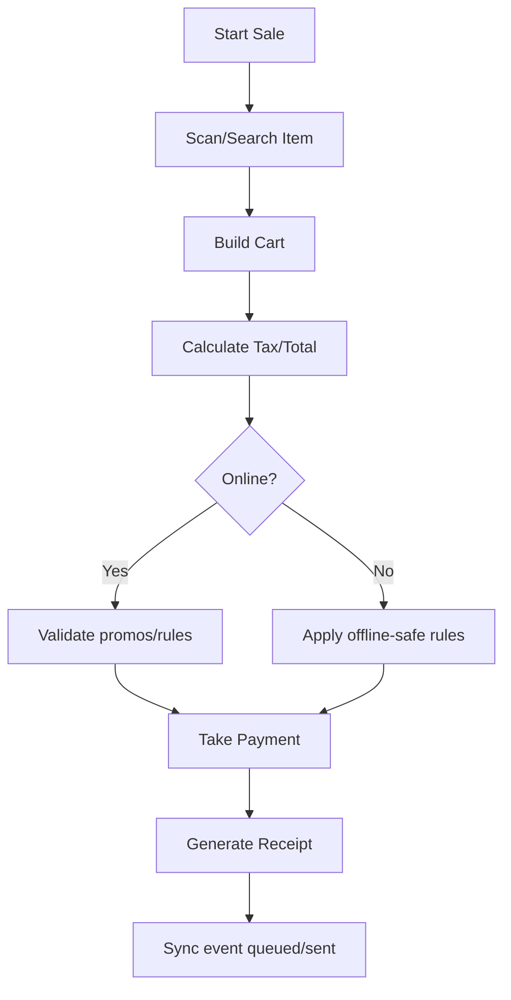
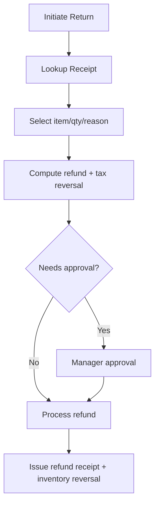
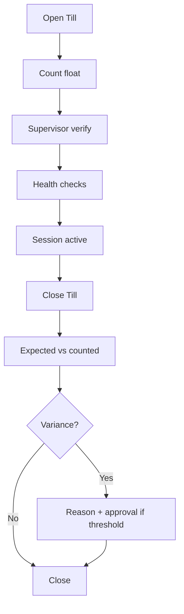
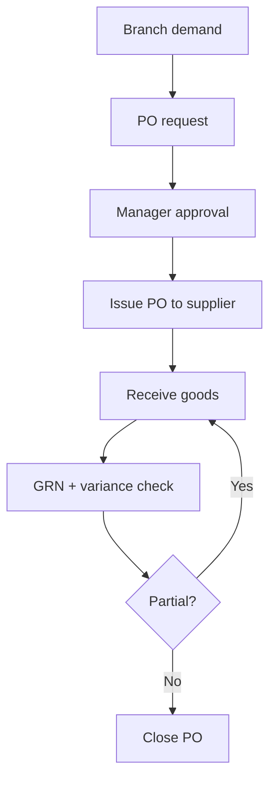
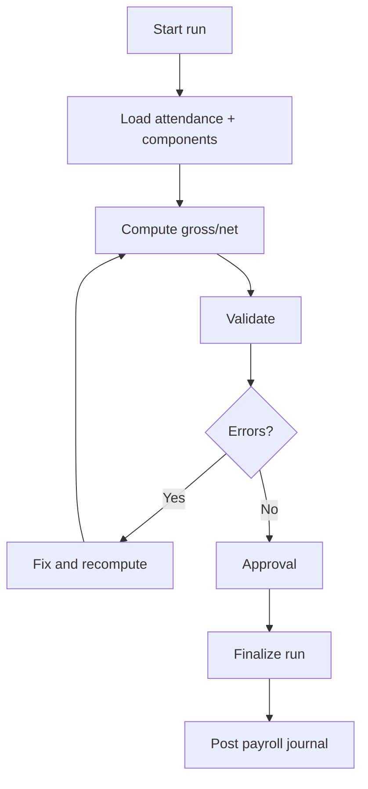

# Key User Flows

## 1) Sell

```mermaid
flowchart TD
  A[Start Sale] --> B[Scan/Search Item]
  B --> C[Build Cart]
  C --> D[Calculate Tax/Total]
  D --> E{Online?}
  E -->|Yes| F[Validate promos/rules]
  E -->|No| G[Apply offline-safe rules]
  F --> H[Take Payment]
  G --> H
  H --> I[Generate Receipt]
  I --> J[Sync event queued/sent]
```

## 2) Return/Refund

```mermaid
flowchart TD
  A[Initiate Return] --> B[Lookup Receipt]
  B --> C[Select item/qty/reason]
  C --> D[Compute refund + tax reversal]
  D --> E{Needs approval?}
  E -->|Yes| F[Manager approval]
  E -->|No| G[Process refund]
  F --> G
  G --> H[Issue refund receipt + inventory reversal]
```

## 3) Till Open/Close

```mermaid
flowchart TD
  A[Open Till] --> B[Count float]
  B --> C[Supervisor verify]
  C --> D[Health checks]
  D --> E[Session active]
  E --> F[Close Till]
  F --> G[Expected vs counted]
  G --> H{Variance?}
  H -->|No| I[Close]
  H -->|Yes| J[Reason + approval if threshold]
  J --> I
```

## 4) PO Lifecycle

```mermaid
flowchart TD
  A[Branch demand] --> B[PO request]
  B --> C[Manager approval]
  C --> D[Issue PO to supplier]
  D --> E[Receive goods]
  E --> F[GRN + variance check]
  F --> G{Partial?}
  G -->|Yes| E
  G -->|No| H[Close PO]
```

## 5) Payroll Run

```mermaid
flowchart TD
  A[Start run] --> B[Load attendance + components]
  B --> C[Compute gross/net]
  C --> D[Validate]
  D --> E{Errors?}
  E -->|Yes| F[Fix and recompute]
  F --> C
  E -->|No| G[Approval]
  G --> H[Finalize run]
  H --> I[Post payroll journal]
```
