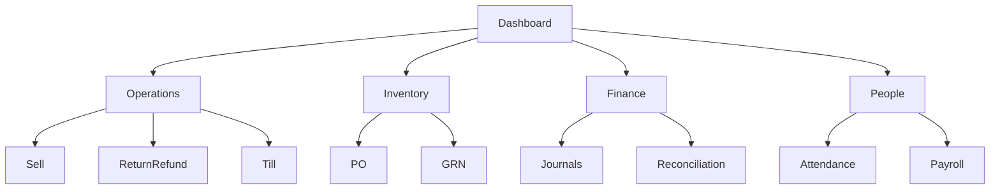

# Navigation Model

## Primary model
- Role-adaptive sidebar (desktop)
- Top bar: sync state, notifications, search
- Context tabs inside modules

## Role menus

### Cashier
- Dashboard
- Sell
- Returns/Refunds
- Till (Open, Active, Cash Drop, Close)

### Branch Manager
- Branch Dashboard
- Till Oversight
- Approval Center
- Reconciliation
- Inventory Requests/PO Tracking
- Attendance Exceptions

### HO Finance
- Finance Control Tower
- Journals
- Reconciliation
- Refund/Variance Oversight
- Period Controls
- Posting Errors

### HR/Payroll Admin
- People Dashboard
- Employees
- Shifts/Rosters
- Attendance Monitor
- Regularizations
- Payroll Runs

## Navigation map

