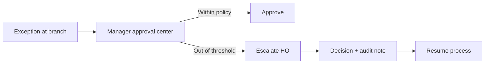

# Role-Based User Journeys

## Cashier
1. Login and select till
2. Open till with float confirmation
3. Process sales (online/offline aware)
4. Handle returns/refunds with policy checks
5. Close till with counted cash + variance reason

## Branch Manager
1. Monitor branch dashboard
2. Approve exceptions (refunds, variances)
3. Track replenishment and PO progress
4. Validate till closures and daily recon

## HO Finance
1. Review control tower by business date
2. Monitor posting completeness and errors
3. Analyze refunds/variances outliers
4. Confirm daily close and period controls

## HR/Payroll Admin
1. Maintain employee master
2. Publish rosters and monitor attendance exceptions
3. Regularize attendance with audit reason
4. Run payroll, approve, and post

## Cross-role exception journey

